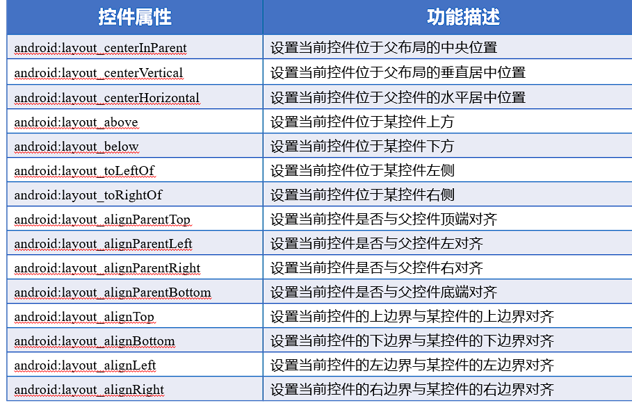
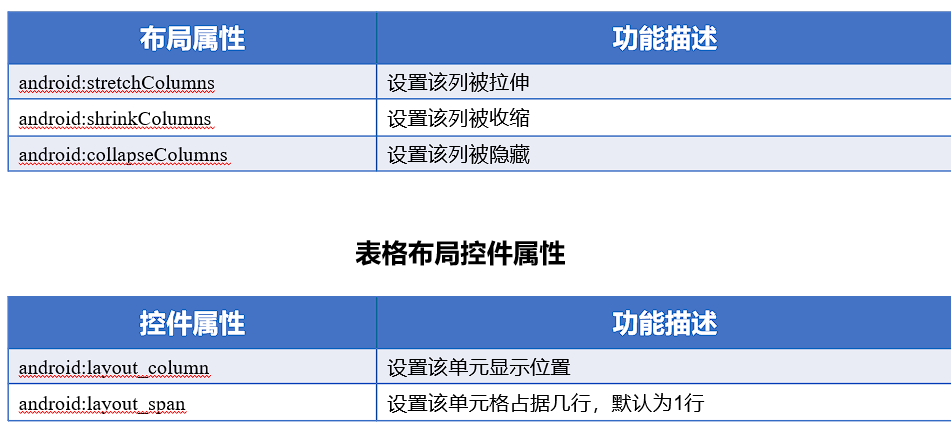
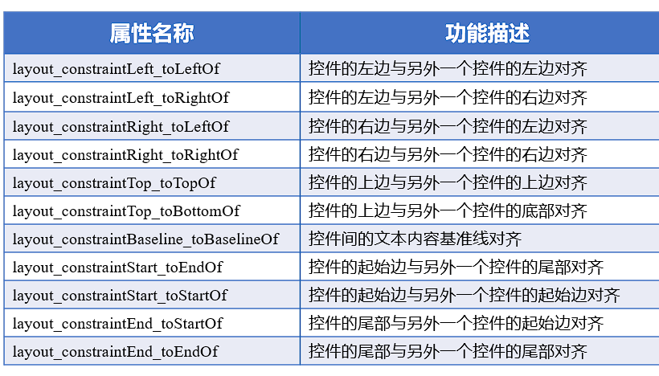

<!--
 * _______________#########_______________________ 
 * ______________############_____________________ 
 * ______________#############____________________ 
 * _____________##__###########___________________ 
 * ____________###__######_#####__________________ 
 * ____________###_#######___####_________________ 
 * ___________###__##########_####________________ 
 * __________####__###########_####_______________ 
 * ________#####___###########__#####_____________ 
 * _______######___###_########___#####___________ 
 * _______#####___###___########___######_________ 
 * ______######___###__###########___######_______ 
 * _____######___####_##############__######______ 
 * ____#######__#####################_#######_____ 
 * ____#######__##############################____ 
 * ___#######__######_#################_#######___ 
 * ___#######__######_######_#########___######___ 
 * ___#######____##__######___######_____######___ 
 * ___#######________######____#####_____#####____ 
 * ____######________#####_____#####_____####_____ 
 * _____#####________####______#####_____###______ 
 * ______#####______;###________###______#________ 
 * ________##_______####________####______________ 
 * 
 * @Author: 崩布猪
 * @Date: 2024-03-18 13:30:29
 * @LastEditors: 崩布猪
 * @LastEditTime: 2024-03-29 10:23:22
 * @FilePath: \undefinedc:\Users\aki\Documents\课业\移动终端设计与开发\_2布局.md
 * @Description: 
 * 
 -->
# 布局
## View视图
在XML文件中编写布局
和在java代码中编写布局
### 布局的通用属性
- android:id 
- android:layout_width 布局的宽度
- android:layout_height 布局的高度
- android:background 布局的背景
- android:layout_margin 当前布局与屏幕边界或者周围空间的举例
- android:padding 当前布局与该布局中空间的距离
  
### RelativeLayout 相对布局
通过相对定位的方式指定子控件位置，即以其他控件或者父容器位参照物，摆放位置

### LinearLayout 线性布局
主要以水平或垂直方式来显示界面中的空间。
- android:orientation 控制排列方向 属性 vertical or horizntal(默认)
  
### TableLayout  表格布局
采用行、列的形式来管理空间，它不需要明确声明包含多少行、多少列，而是通过在TableLayout布局中添加TableRow布局来控制行数 TableRow

### FrameLayout 帧布局
在屏幕上创建一块空白区域，添加到该区域中的每个子控件占一帧，这些帧会一个一个叠加在一起，后加入的空间会叠加在上一个控件上层
所有控件都默认显示在屏幕左上角
- android:foreground="...."  设置帧布局容器的前景图像
- Android:foregroundGravity= "left" 设置前景图像显示位置

### ConstraintLayout 约束布局
适合可视化的方式编写界面布局  

