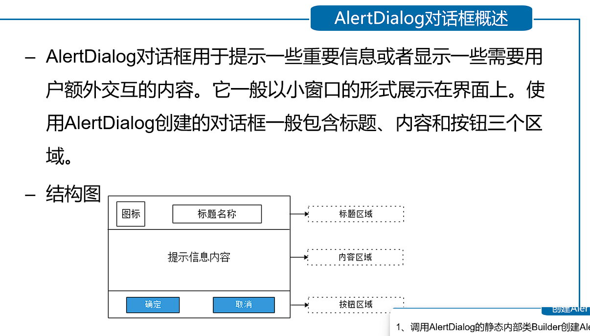

<!--
 * _______________#########_______________________ 
 * ______________############_____________________ 
 * ______________#############____________________ 
 * _____________##__###########___________________ 
 * ____________###__######_#####__________________ 
 * ____________###_#######___####_________________ 
 * ___________###__##########_####________________ 
 * __________####__###########_####_______________ 
 * ________#####___###########__#####_____________ 
 * _______######___###_########___#####___________ 
 * _______#####___###___########___######_________ 
 * ______######___###__###########___######_______ 
 * _____######___####_##############__######______ 
 * ____#######__#####################_#######_____ 
 * ____#######__##############################____ 
 * ___#######__######_#################_#######___ 
 * ___#######__######_######_#########___######___ 
 * ___#######____##__######___######_____######___ 
 * ___#######________######____#####_____#####____ 
 * ____######________#####_____#####_____####_____ 
 * _____#####________####______#####_____###______ 
 * ______#####______;###________###______#________ 
 * ________##_______####________####______________ 
 * 
 * @Author: 崩布猪
 * @Date: 2024-03-25 14:26:21
 * @LastEditors: 崩布猪
 * @LastEditTime: 2024-04-02 16:50:48
 * @FilePath: \课业\移动终端设计与开发\_3View控件.md
 * @Description: 
 * 
 -->

# 控件
## 简单控件分为：
- 控件
    - [TextView1](#textview1)
    - [Button](#button)
    - [EDitView](#editview)c
    - [ImageView](#imageview)
    - [RadioButton](#radiobutton)
    - [CheckBox](#checkbox)
    - [GridView](#GridView)
    - [Toast](#toast)
- 对话框
  - [AlertDialog对话框](#addhk)
  - [自定义对话框](#zdydhk)
- [listView](#listView)
 
### <a id = "textview">TextView1</a>
用于显示文本信息
属性:
  - 
  - 
### <a id = "button">Button</a>
它继承自TextView控件，既可以显示文本也可以显示图片，同时也允许用户通过点击来执行操作，当Button被点击时，被按下与弹起的背景会有一个动态的切换效果，这个效果就是点击效果
- 点击事件的实现方式
  - 
  - 
  - 

### EDitView
表示编辑框 是TextView的子类 用户可以在此控件中输入信息

### <a id = "GridView">GridView</a>
展示网格状的列表
### <a id = "GridView">ImageView</a>
表示图片，继承View 加载各种图片资源

### <a id = "Radiobutton">RadioButton</a>
单选按钮 
Android:checked 属性指定是否选中的状态
它是单选组合框，可以容纳多个RadioView，并且把他们组合在一起，实现单选状态
### <a id = "checkbox">CheckBox</a>
复选框 Button的子类 用来实现多选功能
Android:checked 属性指定是否选中的状态
### <a id = "toast">Toast</a>
Toast 是 Android系统提供的轻量级信息提醒机制，用来向用户提示即使消息，它显示在应用程序界面的最上层，显示一段时间后自动消失不会打断当前操作，也不会获得焦点

### <a id = "addhk">AlertDialog 对话框</a>

### <a id = "ptdhk">普通对话框</a>

单选对话框
的内容区域显示为单选列表。单选列表通过AlertDialog.Builder对象调用 setSingleChoiceItem()方法设置的。
多选对话框
setMultiChoiceItems()方法设置的。
### <a id = "zdydhk">自定义对话框</a>

### <a id = "listView">listView</a>
listView 是以列表的形式展示数据内容，并且能够根据列表的高度自适应显示
属性：

常用的数据适配器