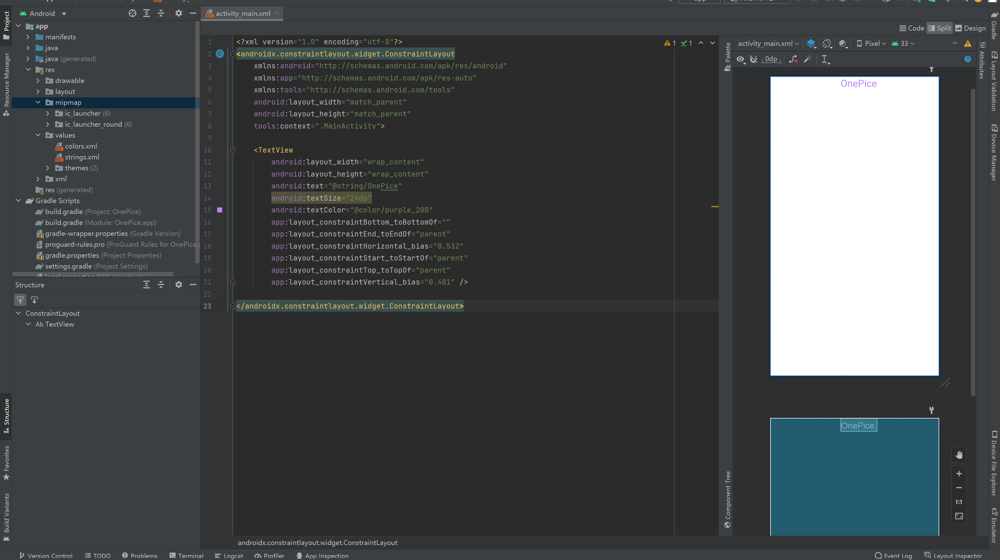

<!-- 
 * _______________#########_______________________ 
 * ______________############_____________________ 
 * ______________#############____________________ 
 * _____________##__###########___________________ 
 * ____________###__######_#####__________________ 
 * ____________###_#######___####_________________ 
 * ___________###__##########_####________________ 
 * __________####__###########_####_______________ 
 * ________#####___###########__#####_____________ 
 * _______######___###_########___#####___________ 
 * _______#####___###___########___######_________ 
 * ______######___###__###########___######_______ 
 * _____######___####_##############__######______ 
 * ____#######__#####################_#######_____ 
 * ____#######__##############################____ 
 * ___#######__######_#################_#######___ 
 * ___#######__######_######_#########___######___ 
 * ___#######____##__######___######_____######___ 
 * ___#######________######____#####_____#####____ 
 * ____######________#####_____#####_____####_____ 
 * _____#####________####______#####_____###______ 
 * ______#####______;###________###______#________ 
 * ________##_______####________####______________ 
 * 
 * @Author: 崩布猪
 * @Date: 2024-03-04 13:38:12
 * @LastEditors: 崩布猪
 * @LastEditTime: 2024-03-13 11:20:06
 * @FilePath: \P_code\移动终端设计与开发\bease.md
 * @Description: 
 * 老师：曹义
    qq： 402523131
    课程简介，主要做安卓开发，56学时 24学时上机
 *  -->

Android
   由谷歌基于Linux开发的开源系统
和 iOS对比
   用户 隋唐样本 大概7 3 开
   开发语言  java kotlin  ios objective-c swift
   系统开放性 开源   封闭
   系统安全性 开源   封闭
   
三种开发方式
   1.Native APP
   2.Web APP
   3.Hybrid APP
   aosp：安卓的开源项目
hello wold 

- res文件夹 存放程序的资源文件
  - drawable 图片
  - layout 布局文件
  - mipmap 图标
  - values 资源文件
  - xml
  - 