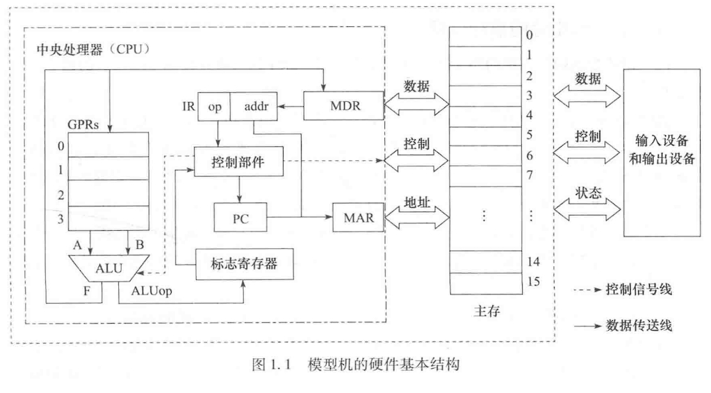

<!--
 * _______________#########_______________________ 
 * ______________############_____________________ 
 * ______________#############____________________ 
 * _____________##__###########___________________ 
 * ____________###__######_#####__________________ 
 * ____________###_#######___####_________________ 
 * ___________###__##########_####________________ 
 * __________####__###########_####_______________ 
 * ________#####___###########__#####_____________ 
 * _______######___###_########___#####___________ 
 * _______#####___###___########___######_________ 
 * ______######___###__###########___######_______ 
 * _____######___####_##############__######______ 
 * ____#######__#####################_#######_____ 
 * ____#######__##############################____ 
 * ___#######__######_#################_#######___ 
 * ___#######__######_######_#########___######___ 
 * ___#######____##__######___######_____######___ 
 * ___#######________######____#####_____#####____ 
 * ____######________#####_____#####_____####_____ 
 * _____#####________####______#####_____###______ 
 * ______#####______;###________###______#________ 
 * ________##_______####________####______________ 
 * 
 * @Author: **崩布猪**
 * @Date: 2024-03-06 13:30:58
 * @LastEditors: 崩布猪
 * @LastEditTime: 2024-03-08 18:52:31
 * @FilePath: \P_code\计算机组成原理\base.md
 * @Description: 计算机组成原理ff
 * 老师：闫晓丽
 * 基本信息： 笔试 3 7 比例 平时 期末 
 -->

## 概论
* 学习视角
  * 空间视角
  * 时间视角
* 第一该电子计算机
  * ABC
  * 作者约翰.文森特.阿塔纳索夫
  * 他在计算机界被称为'电子计算机之父'
## 冯诺依曼计算机 
### 基本思想
  必须将事先编好的程序和原始数据送入主存后才能执行程序，一旦程序被执行启动，计算机能在不需要操作人员干预下自动完成逐条指令取出和执行的任务
### 特点
- 计算机由运算器、存储器、控制器、输入设备和输出设备五大部件组成
- 指令和数据以同等地位存放在存储器内，可以按地址访寻
- 指令和数据以二进制数表示
- 指令由操作码和地址吗组成
- 指令在存储器内按顺序存放
- 机器以运算器为中心
###  计算机的基本结构
现代计算机是由 CPU I/O设备 主存 三大部分组成

	![[Pasted image 20240618144244.png]]
    
      
	  ![[Pasted image 20240618144429.png]]
	  ![[Pasted image 20240618144643.png]]

#### CPU（中央处理器）
##### 运算器 （ALU）
用于完成算数运算和逻辑运算。
算数运算：基本的数学运算
逻辑运算：对逻辑值的运算，and or not xor
ALU 算数逻辑运算单元
ACC 累加器
MQ 乘商计数器
##### 控制器 （CU）
用于控制、指挥程序和数据的输入、运行以及处理运算的结果
PC 程序计数器
IR 指令寄存器 
CU 控制单元
##### 寄存器
1.用户可见寄存器
通用寄存器
数据寄存器
地址寄存器
条件码寄存器
2.控制和状态寄存器
MAR 存储器地址寄存器
MDR 存储器数据寄存器
PC 
IP 
##### 中断系统 

### 主存或内存：
用来存储数据
包括存储体M、各州逻辑部件和控制电路

### I/O输入输出设备
用于连接"人"与计算机

I/O 设备 和 相应的接口
## 计算机硬件的主要技术指标
### 机器字长

CPU一次能处理数据的位数 与 数据寄存器位数有关
数据总线
### 存储容量

**主存**：
存储容量 = 存取单元 * 存储字长 例如 1K * 8b   2地址线 * 2数据线
辅村：字节数 例 80GB
最小单位：b（bit）
基本存储单位： B（字节 = 8b）

### 运算速度
   
普遍采用单位时间内执行指令的平均条数衡量， 用MIPS作为计量单位
或，CPI（执行一条指令所需要的时钟周期）
或 FLOPS (浮点运算次数每秒)
