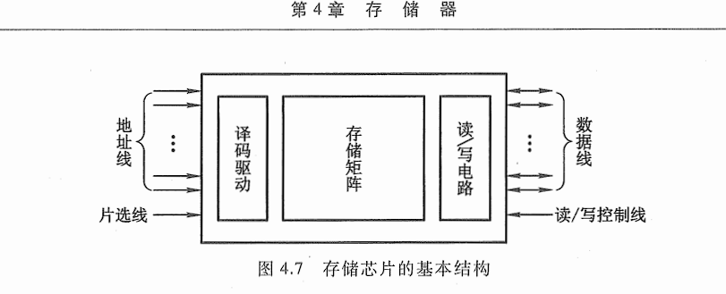

<!--
 * _______________#########_______________________ 
 * ______________############_____________________ 
 * ______________#############____________________ 
 * _____________##__###########___________________ 
 * ____________###__######_#####__________________ 
 * ____________###_#######___####_________________ 
 * ___________###__##########_####________________ 
 * __________####__###########_####_______________ 
 * ________#####___###########__#####_____________ 
 * _______######___###_########___#####___________ 
 * _______#####___###___########___######_________ 
 * ______######___###__###########___######_______ 
 * _____######___####_##############__######______ 
 * ____#######__#####################_#######_____ 
 * ____#######__##############################____ 
 * ___#######__######_#################_#######___ 
 * ___#######__######_######_#########___######___ 
 * ___#######____##__######___######_____######___ 
 * ___#######________######____#####_____#####____ 
 * ____######________#####_____#####_____####_____ 
 * _____#####________####______#####_____###______ 
 * ______#####______;###________###______#________ 
 * ________##_______####________####______________ 
 * 
 * @Author: 崩布猪
 * @Date: 2024-03-16 10:25:23
 * @LastEditors: 崩布猪
 * @LastEditTime: 2024-04-03 13:33:16
 * @FilePath: \课业\计算机组成原理\4_存储器.md
 * @Description: 
 * 
 -->
# 存储器 重点

## 4.1 分类
### 按照存储介质分
    - 半导体存储器
    - 磁表面存储器
    - 磁芯存储器
    - 光盘存储器 
### 按照存取方式分类
  - 随机存储器 RAM \*
  - 只读存储器 ROM \*
  - 串行访问存储器
### 按照计算机中的作用分类

#### 主存
##### RAM
    - 静态 RAM
    - 动态 RAM
##### ROM
    - MROM
    - PROM
      - EPROM
    - EEPROM
####  闪速 Flash Memory

#### 辅存
      - 磁带
      - 光盘
      - 磁盘
#####  缓存(Cache) \*
### 存储器的层次结构
存储器的性能指标
容量 速度 价格
CPU ＋ 主存  == 主机
- 主要关系 速度 从快到慢 容量 从小到大 价位 从高到低
- ![[Pasted image 20240618180418.png]]
- 缓存-主存层次
  - 解决CPU和主存访问速度不匹配的问题
- 主存-辅存层次
  - 解决存储系统的容量问题
- 
## 4.2 主存储器
### 概述

  #### 基本组成
  - 
    - MDR 和 MAR 在cpu芯片内
    - 驱动器 存储体 读写电路 控制电路 
    - 时序的先后顺序 *
    - 结构 *
    - 译码器由多少条线路取决于MAR线的个数*
  - cpu 主存之间
    - 数据线
    - 地址线
    - 控制线
  - 主存中存储的那元地址的分配
    - 存储单位 位 基本单位 字节
    - 双字 四字  字存储  分配方法 低对低 高对高 or 低对高 高对低 
  - 寻址方式
    - CPU 只和 内存 交换信息
    - 按字节寻址 一个字节一个地址
      - 地址线24跟 224 = 16M *1b
    - 按字寻址  一个字一个地址
      - 字 4M*
  - 技术指标
    - 存储容量
		  存储单元的个数 * 存储字长 =存储容量
    - 存储速度
    - 存储器带宽
#### 半导体存储芯片
基本结构 

  - 地址线 (单向)
  - 数据线(双向)
  - 译码驱动 存储矩阵 
##### RAM 随机存储器
- 静态RAM(SRAM)
  - 存储0/1电路的存储器
  - 触发器工作原理存储信息，掉电后，存储信息丢失，信息读出后仍然保存原状态
- 动态RAM（DRAM）
  - 用电容器存储电荷的原理来寄存器信息
  - 刷新周期 2ms 集中 分散 异步 
  - 死区
  - 死时间率
SRAM 和 DRAM 比较
 随机存取存储器 （RAM）
  静态RAM （SRAM）
  动态RAM （DRAM）
  
##### 只读存储器 （ROM）
PROM
EPROM
EEPROM

### 存储器 与 CPU 的连接
存储容量的扩展
- 位扩展（增加存储字长）
  - 数据线分别依次连接 其他线连接到一起
- 字扩展 （增加存储字的容量）
  - 将多的地址线 做片选信号 连接CS。 其他线连接到一起
- 字位扩展（先位扩展，在字扩展） 
存储器 与 cpu连接
- 地址线连接
- 数据线连接
- 控制线连接
- 片选线连接

### 存储器校验
#### 奇偶校验
  - 奇校验：原始数据位加上校验位（只有1个）后，1 的个数应为奇数
  - 偶校验：原始数据位加上校验位后，1 的个数应为偶数
  - 步骤：
    - 确定校验位数
    - 确定校验位置
    - 确定校验的值
  - 缺点：智能检测奇数个 个位数错误，不能检测偶数个 个位的错误，而且不能具体到哪一位，所以没有纠错功能
####  **汉明码校验** *
  - 校验位：2k >= n + 1
  - 校验位的位置：2i
  - 检测位的取值：与改位所在的检测小组承担的奇偶校验任务有关
  - P101
  - 纠错过程：
    - 对接收的数据，重新校验，形成新的检测位Pi。
    - 按照配偶原则配置的汉明码，传送后形成新的检测应为pi位 0 

#### 提高访存速度的措施
## 高速缓冲存储器
cpu <--> 内存 <---> 硬盘
因为 cpu 和 内存 中的传输速度不统一 会出现 cpu “空等”现象 所以在 cpu 中加入了一个 Cache(高速缓冲存储器)
基本结构
- Cache 存储体
- 地址映射变换机构
- 替换机构
Cache 的读写操作
写
- 写值达法：写操作时数据即写入 Cache 又写入主存
- 写回法： 线写入缓存 当 Cache 数据块被替换出去的时候才写回主存
Cache 的改进：
- 增加 Cache 的级数
- 统一缓存 和 分立缓存

性能因素
命中率
95
### Cache - 主存的地址映射
#### 直接映射
  - 在全相联的基础上 并分组 or 把主存每一块映射到固定 Cache 行中
  - 主存按缓存的大小分组 进而产生 TCB
主存地址

| 主存字块标记 | Cache字块地址 | 字块内地址 |
| :----: | :-------: | :---: |
|   t    |     c     |   b   |

cache行号 = 主存块号 % cache行数
 主存 m b
 cache c b
 地址线
#### 全相连映射
  - 主存中的任何一块可以映射到缓存中的任意一块 *
  - 主存地址 = 标记 块内地址
主存地址

| 主存字块标记 | 字块内地址 |
| :----: | :---: |
|  t+c   |   b   |

- 组相连映射
  - 将 Cache 分成大小相等的组，每个主存块被映射到 Cache 固定组中的任意一行
  - Cache 分组 主存也分组 2 路组相联 每组等于 2 r=1 4路组相连 每组等于4
  - Cache号 = 主存快好 % cache 组数
  - 主存 标记 cache组号 块内地址k
  - 主存 m-q q b
  - cache q r b  二路组 r = 1  四路组 r = 2
主存地址

| 主存字块标记  |  组地址   | 字块内地址 |
| :-----: | :----: | :---: |
| s = t+r | q= c-r |   b   |
| m =s +q |        |       |

# 例题
 例 
 - 4.1 P95
 - 4.2
 - 4.3
 - 4.4 P102
 - 4.5 
 - 4.8
 - 4.9
 - 4.10
习题
- 4.5
- 4.6
- 4.7
- 4.14
- 4.15
- 4.17
- 4.18
- 4.28
- 
