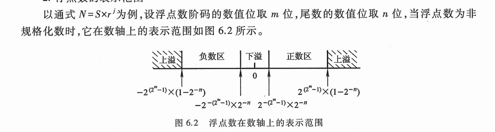

<!--
 * @Author: 崩布猪
 * @Date: 2024-04-10 13:26:51
 * @LastEditors: 崩布猪
 * @LastEditTime: 2024-06-07 15:32:11
 * @FilePath: \CS\计算机组成原理\6_计算机的运算方法.md
 * @Description: 
 * 从这一章开始要深入了解中央处理器CPU，当然在了解之前需要先了解计算机中数据的表示方法，本章主要介绍了计算机的运算方法，包括有符号数和无符号数的表示方法，定点表示和浮点数表示，以及算数逻辑单元的运算方法。
-->

# 计算机的运算方法

## 6.1 有符号数和无符号数

在计算机中，数据都是以二进制数表示的，但由于不同计算机系统的设计者对二进制数的表示
方式不同，导致了数据表示的不同。
  
- 无符号数：
  - 主要用来表示存储单元的地址，不参与运算。 
  - 一般为 8 位 或者 16 位。
  - 数据范围 0 到 2^n-1。

### 有符号数：
  - 最高位为符号位，0表示正数，1表示负数。
  - 参与运算
  - 数据范围 -2^(n-1) 到 2^(n-1)-1。

机器数与真值：

- 真值：带符号的二进制数。
- 机器数：将真值的符号数字化，并用二进制表示。

原码、反码、补码、移码：
- 原码：符号位加上真值的绝对值。符号位 0 表示正数，1 表示负数。
- 补码：符号位不变 其余位取反 + 1   求补运算： 由 [x]补 补求 [-x]补 所有位数取反 + 1。
- 反码：符号位不变，其余位取反。
- 移码：补码符号位取反，其余位不变。用于表示浮点数的阶码，方便判断浮点数的阶码大小
- 补充
  - 整数的符号位与数据位之间用 ， 隔开
  - 浮点数符号位与数值位之间用 . 隔开
  - 阶码：指数部分。
  - 浮点数：指数位、尾数位。尾数位的精度由指数位确定。

## 6.2 数的 定点表示 和 浮点数表示 
小数用顶点表示 和 浮点数表示

定点数：
用顶点机操作数的整数部分和小数部分表示。 小数点的位置固定
- 定点整数（纯整数）: 123.
- 定点小数：（纯小数）0.345 0.34
整数定点机的范围: - (1-2-n) ~ (1-2-n)
小数定点机的范围: - (2n-1) ~ (2n-1)

浮点数:
小数点位置可以移动,
表示形式
N = S* rj
S 尾数定点小时 反应符号与和精度
j 阶码定点整数 反应大小 用二进制表示
r 基数
浮点数的表示范围：

  
|阶符|阶码的数值部分|位数符号|尾数的数值部分|
|-|-|-|-|
| 1/0| | 1/0| |

例如 
N= S* rj
11011.00011 = 0.1101100011 * 2101

规格化
原码:
0.1xxxxxx
1.1xxxxxx
补码
1.oxxxxxx
0.1xxxxxx

|阶符|阶码的数值部分|位数符号|尾数的数值部分|
|-|-|-|-|
|符号位|101|符号位 |0.1101100011|

1;101;1;0.1101100011; 中间用分号隔开

浮点数范围：

机器零：两个情况
- 浮点数位数为0
- 阶码<=它所能表示的最小数时

IEEE 754标准

| 位数符号 | 阶符 |阶码的数值部分|尾数的数值部分|
|-|-|-|-|
| 1/0|1/0 | | |

## 6.3 定点的运算
定点整数
定点小数

浮点数 N = S * rj
尾数是定点小数
阶码是定点整数

逻辑运算(无符号数)
算数运算

#### 1. 算数移位的规则:
- 负数的补码 左移补0 右移补1 
- 负数反码补1 
- 其他数补零
- 对于正数 和 负数的原码： 左移出1 结果会错 右移出1 影响精度 
- 负数补码 和 反码 左移出0 计算出错 右移出0 影响精度 

#### 2. 加减运算(小数同理):
   - [A]补+[B]补 = [A+B]补
   - [A-B]补 = [A]补 + [-B]补
   - [-B]补 = [B]补 所有位取反 + 1
#### 3. 溢出判断 
一位符号位 判断溢出 
  - 两个操作数符号相同，但结果的符号与原来的符号不同，溢出
  - 进位判断：最高有效位的进位 异或 符号位的进位 = 1 则有溢出  
     
两位符号位，判断溢出  
 - 两个符号位不同则溢出 
#### 5. 乘法运算
原理 通过笔算发改进 乘法是 右移 加法运算
真值的规则： 乘数的末位决定别成熟是否与原部分积相加 然后 右移一位 形成新的部分积； 同时，乘数也 右移一位 ，有地位作新的末位，空出的最高位放部分积的最低位
- 原码一位乘运算： 符号位异或，其他位绝对值相乘
- 原码二位乘运算： 符号位异或，其他位绝对值相乘

  
补码一位乘 矫正法

    乘数 为正
    同原码成 但是 加 和 位移 按照补码规则运算 乘机的符号自然形成

    乘数为 负
    乘数[y]补 去掉符号位 同源码成 最后加 【-x】补

Booth算法（补码比较法）也是补码两位乘

    00 右移1位
    01 加[x]补 右移1
    10 加[-x]补 右移/lo'lii'ji'k'i 
    11 右移 

    
#### 6. 除法运算

原码

    恢复余数法
      余数为正 商1，左移
      余数为负，商0， ＋y补 左移
    加减交替法
      余数 x + -y补 一次
      余数为正 商1 左移 + -y补
      余数为付 商零 左右 + y补

## 6.4浮点四则运算

1. 浮点的格式

    符号位n =s *rj
2. 对阶

    小阶到大阶（误差小） 阶小的位数右移，阶码加1

3. 规格化

    规格化形式 s补 = 00.1 或者 11.0 形式
    左规，00.1 or 11.0 位数左移 阶码减一
    右规，01. or 10. 位数右移 阶码加一

4. 舍入

    0舍加1法： 右移去0 舍去 右移 去1 加1；
    横置1法： 不论移去0或1，位数末尾全为1.

5. 溢出判断
   有阶码符号决定 01 上溢；10 下溢 按机器零处理。
## 6.5 算数逻辑单元 (略过)

## 例题
- 例题6.3 P231
- 6.4
- 6.5
- 6.6fccse
- 6.8
- 6.10
- 6.17 P245
- 6.18
- 19
- 20
- 24 P261
- 25
- 26
- 29s
- 30
ti
6.5
12
19
20

