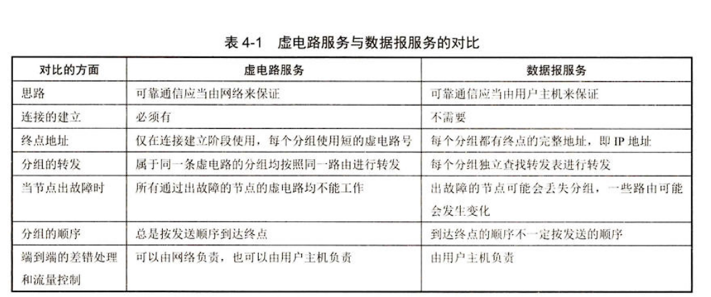
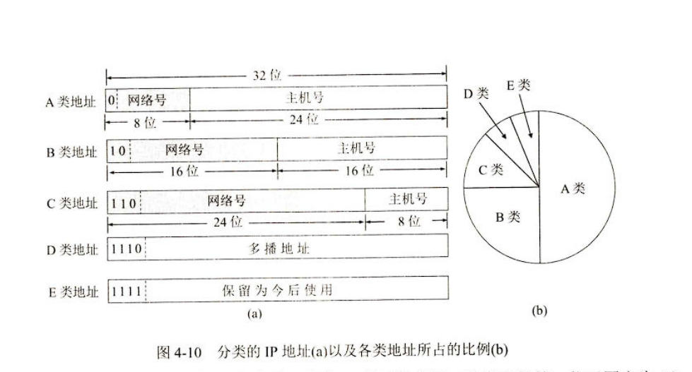
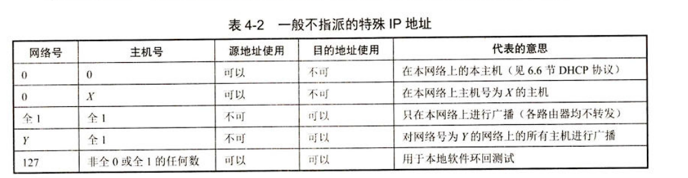

<!--

 * @Author: 崩布猪
 * @Date: 2024-04-01 15:20:53
 * @LastEditors: 崩布猪
 * @LastEditTime: 2024-04-09 15:52:12
 * @FilePath: \课业\计算机网络\__04_网络层.md
 * @Description:  计算机网络 网络层的内容
 * 
 -->
# 网络层
重要内容
- 虚拟互联网络和两种服务、两个层面的概念
- IP 地址 与 MAC 地址的关系
- 传统分类的 IP 地址和无分类域间路由选择 CIDR
- 路由选择协议的工作原理
## 网络层的几个重要概念
##### 网络层提供的两种服务
- 第一种：虚电路
- 第二种：数据报
- 
##### 网络层的两个层面
数据层面
- 路由器根据本路由器生成的转发表，把收到的分组从查找的对应接口转发出去
- 独立工作
- 采用硬件进行转发，快

控制层面
- 根据路由选择协议所用的路由算法计算路由创建出路由器的路由表
- 许多路由器协调工作
- 采用软件计算，慢

SDN
新的层面SDN 既有控制层面又有控制层面

## 网际协议 IP
IP 是 TCP/IP 体系中两个最主要的协议之一 另一个是传输层的TCP
IPv4 版本
与 IP 配套的协议
- ARP 地址解析协议
- ICMP 网际控制报文协议
- IGMP 网际组管理协议

##### 虚拟互联网络
实现网络互联、互通的需要解决的问题
- 不同的寻址方案
- 不同的最大分组长度
- 不同的网络接入机制
- 不同的超时控制
- 不同的差错回复方法
- 不同的状态报告方法
- 不同的路由选择技术
- 不同的用户接入控制
- 不同的服务
- 不同的管理与控制方式

方法：将网络互联中使用一些中间设备
根据层次分的设备：
- 物理层 使用的中间设备 叫做 转发器
- 数据链路层 网桥 or 桥接器 和交换机
- 网络层 路由器
- 网络层 以上 网关

### IP 地址
##### IP 地址及其表示方法
IP地址是给连接到互联网上的每一太的主机的接口，分配在一个全世界范内是唯一的32位标识符。
32 位的二进制代码
IP地址 ::= { <网络号>，<主机号>}

**分类的IP地址**
早期采用

其中A类
- 网络号 全0 表示本网络
- 网络号 127 作为本地软件换回测试
- 主机号 全0 表示单个网络地址
- 主机号 全1 表示所有的

这种放发面临了 IP 资源枯竭的问题 提出了新的方法 CIDR 有所缓解

**CIDR 无分类域间路由**
- CIDR中把网络号 改为网络前缀
IP地址 ::= {<网络前缀>,<主机号>}
其中 网络前缀的位数不固定 是0-32任意值
斜线记法
- 地址块：     
    - 前缀相同且连续的IP组成一个 CIDR 地址块 
- 地址掩码(又称为子网掩码)
    - 由于计算机看不到/ 所以使用32位的地址掩码 从 IP 地址迅速推算出网络地址  
    - 地址掩码由 一连串1 接着 一连串0组成 1的个数就是前缀的长度
    - 三个特殊的地址快
    - n = 32 这个特殊地址用于 主机路由
    - n = 31 这个地址只有两个 IP 地址 主机号分布位0/1 用于点对点路由
    - n = 0 用于 默认路由
网络地址 = IP地址 域 地址掩码 按位 与运算

**IP 地址的特点**
- 每一个 IP 地址都由网络前缀和主机号两部分组曾
- 实际上 IP 地址是标志一台主句和一条链路的接口
- 转发器或交换机连接起来的若干个局域网仍然为一个网络
- 在 IP 地址中，所有分配到网络前缀的网络都是平等的